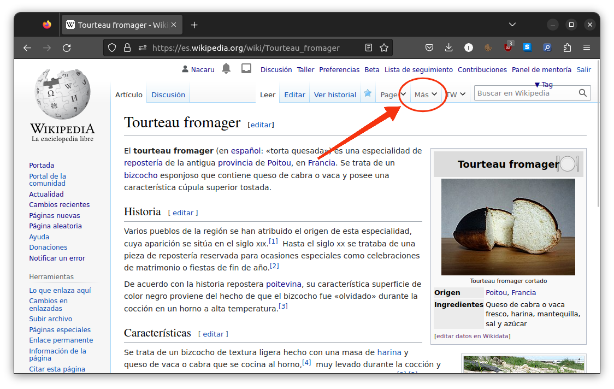

## 

[`es.wikipedia.org/wiki/Wikipedia:Twinkle_Lite`](https://es.wikipedia.org/wiki/Wikipedia:Twinkle_Lite)

## ¿Qué es Twinkle Lite?

- Herramienta concebida para facilitar el mantenimiento en Wikipedia
- Basada en una herramienta homónima desarrollada en la Wikipedia inglesa (¡que ya tuvo un intento de integración en eswiki en 2008!)*
- Escrita en el lenguaje de programación [JavaScript](https://es.wikipedia.org/wiki/JavaScript)

::: notes
El Twinkle primigenio en eswiki permaneció utilizable durante unos años y fue posteriormente abandonado
:::

***

- Hace uso de una librería mantenida por usuarios de la Wikipedia inglesa llamada [Morebits](https://en.wikipedia.org/wiki/MediaWiki:Gadget-morebits.js).
- Emplea la [API](https://www.mediawiki.org/wiki/API:Main_page) de MediaWiki.
- «Lite» porque está concebido como una versión ligera y sencilla de mantener en el tiempo.

# Instalación  {data-background-image="img/Elegant_Background-3.jpg"}

## Instrucciones

(Toda la información se halla en [la página de documentación en Wikipedia](https://es.wikipedia.org/wiki/Wikipedia:Twinkle_Lite#Instalaci%C3%B3n))

***

- Crea tu página especial `common.js`: puede hacerse a través de [este enlace](https://es.wikipedia.org/wiki/Especial:MiP%C3%A1gina/common.js)
- Una vez creada, copia en ella la línea de código que aparece aquí ([también disponible en la documentación](https://es.wikipedia.org/wiki/Wikipedia:Twinkle_Lite#Instalaci%C3%B3n)):*

    mw.loader.load("https://es.wikipedia.org/w/index.php?title=Usuario:Nacaru/twinkle-lite.js&action=raw&ctype=text/javascript");
 

::: notes
Probablemente en el futuro podrá activarse a través de la página de configuración personal
:::

*** 

- Refresca la caché del navegador (Ctrl + F5 o Ctrl + R).

¡Ya estaría listo!

***

Si todo se ha instalado correctamente debería de aparecer este menú en la parte superior de la interfaz:

{ width=80% }

***

Si usas la interfaz antigua Vector 2010 o si has ocultado el menú de la derecha, las opciones de Twinkle Lite se situarán en el menú de edición superior en su lugar.

{ width=80% }

# Utilización {data-background-image="img/Back3.png"}

## Etiquetado

TL posee un módulo que incluye un catálogo de plantillas que pueden colocarse en el artículo.

{ width=9.25em }

También incluye una opción para notificar al creador de la página, así como para especificar una razón.

## Avisos a usuarios

De forma similar, pueden dejarse mensajes en la página de usuario de forma sencilla mediante el catálogo.

{ width=9.25em }

## Borrado rápido

Módulo para colocación de plantillas de borrado rápido, útil p. ej. en casos de creación de páginas vandálicas

{ width=9.25em }

## Denuncias

Permite denunciar usuarios a través de un simple formulario.

{ width=9.25em }

El _script_ se encarga automáticamente de colocar la denuncia en el tablón adecuado.

## Protección de páginas

Muestra el estado de protección de una página y permite solicitar su protección.

{ width=9.25em }

También se puede utilizar para solicitar la __desprotección__ de una página.

## Consultas de borrado

Simplifica todo el proceso de apertura de una consulta de borrado a través de un formulario.

{ width=9.25em }

Al igual que otros módulos, incluye una opción para dejar un mensaje de aviso en su PD a la persona que creó la página.

# Futuro {data-background-image="img/Elegant_Background-2.jpg"}

## Ideas

- Expandir el módulo de etiquetado para incluir plantillas que van en otras posiciones dentro del artículo (`{{control de autoridades}}` o `{{NF}}`).
- Añadir características que ayuden al mantenimiento de tareas específicas de los bibliotecarios.
- Habilitar la posibilidad de activar herramienta en el menú de configuración de usuario a través de [MediaWiki:Gadgets-definition](https://es.wikipedia.org/wiki/MediaWiki:Gadgets-definition) (hay una solicitud procesándose en el tablón de editores de interfaz)

# Fin

## Enlaces

- [Página de documentación en eswiki](https://es.wikipedia.org/wiki/Wikipedia:Twinkle_Lite)
- [Repositorio público en GitHub](https://github.com/nacaru-w/twinkle-lite)
- [Página de Wikipedia en la que se encuentra el código concatenado](https://es.wikipedia.org/wiki/Usuario:Nacaru/twinkle-lite.js)

## Atribución de imágenes

- [Back3 de pbgtree](https://commons.wikimedia.org/wiki/File:Back3.png) (CC BY-SA 4.0)
- [Elegant Background-3](https://commons.wikimedia.org/wiki/File:Elegant_Background-3.jpg) y [Elegant Background-2](https://commons.wikimedia.org/wiki/File:Elegant_Background-2.jpg) de Nick Roach (GNU)
