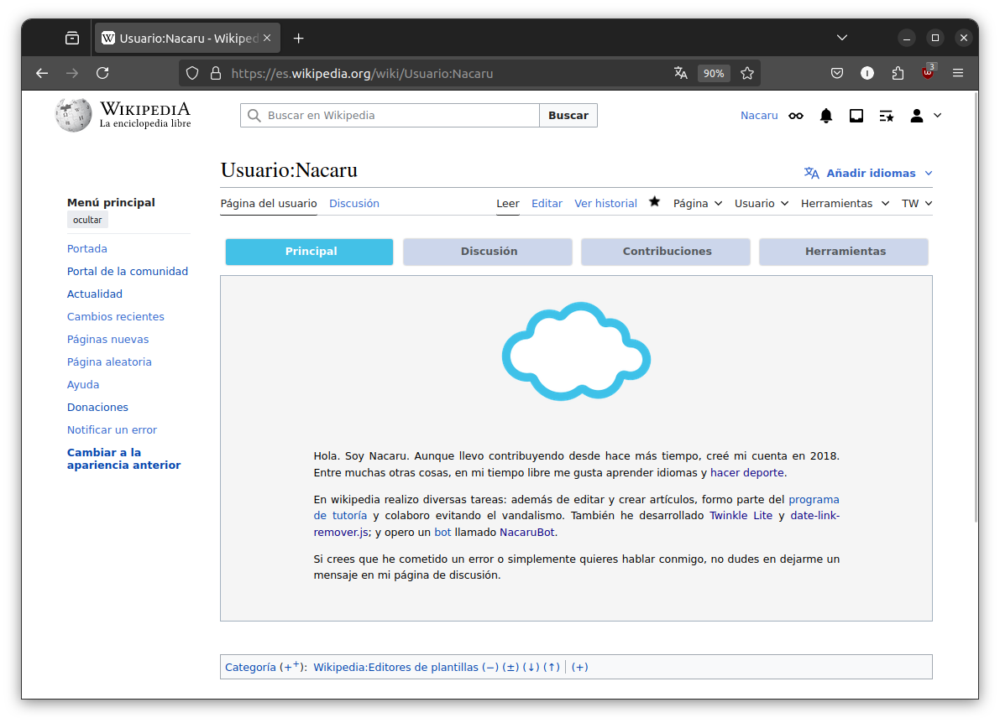
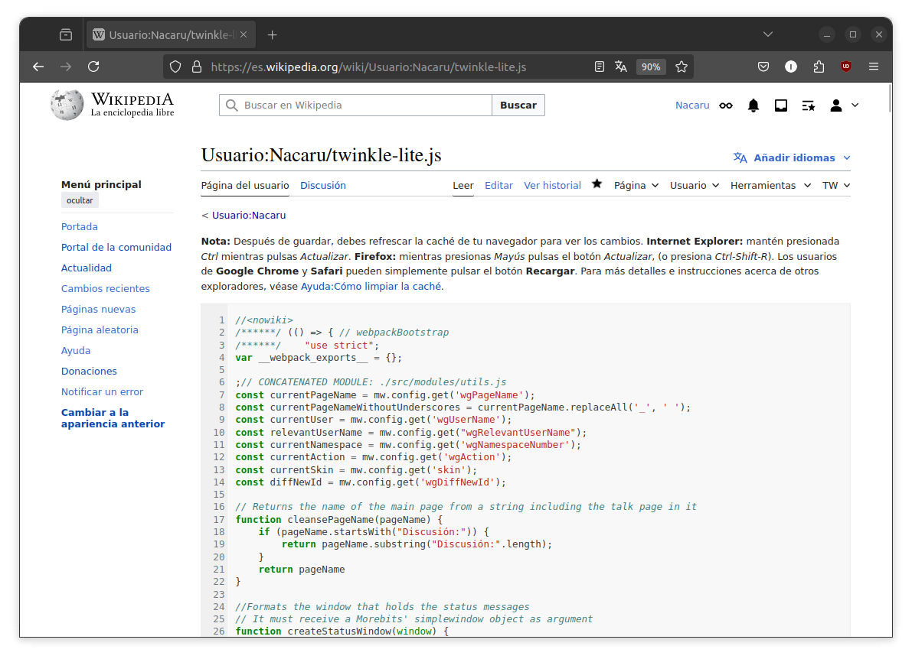
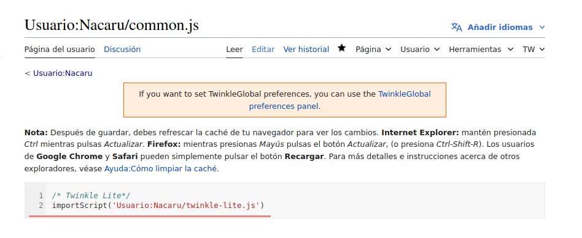
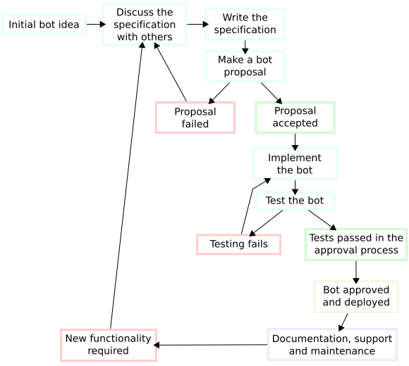
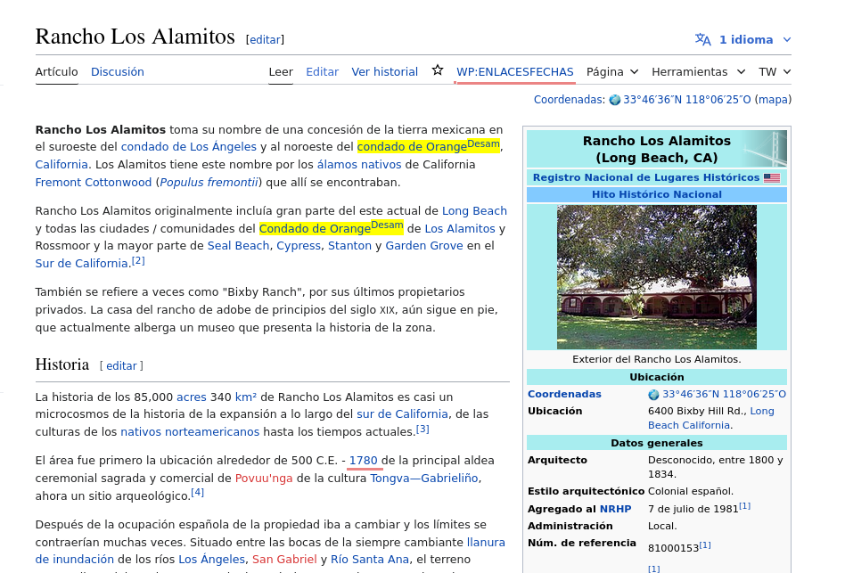
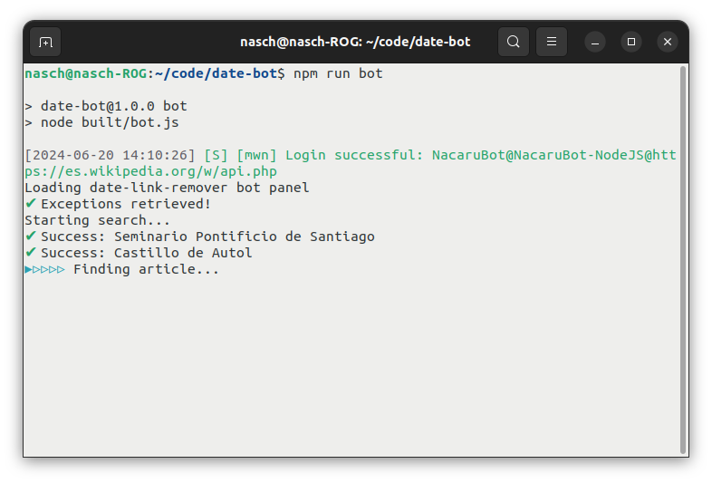

## 

[`https://github.com/nacaru-w`](https://github.com/nacaru-w)

## Cómo hacer scripts para Wikipedia

- Wikipedia (y el resto de proyectos Wikimedia) permiten elaborar scripts de usuario a través de las subpáginas de ese espacio de nombres.
- Estos scripts pueden importarse través de tu página de `common.js` ([es.wikimedia.org/Usuario:NOMBRE DE USUARIO/common.js](https://es.wikipedia.org/wiki/Especial:MiP%C3%A1gina/common.js))

***

***

***

Solo hay que añadir `importScript('RUTA DEL SCRIPT EN WP')` para que empiece a funcionar.

***

## ¿Qué es Twinkle Lite?
[https://github.com/nacaru-w/twinkle-lite](https://github.com/nacaru-w/twinkle-lite)

- Herramienta concebida para facilitar el mantenimiento en Wikipedia
- Basada en una herramienta homónima desarrollada en la Wikipedia inglesa (¡que ya tuvo un intento de integración en eswiki en 2008!)*
- Escrita en [JavaScript](https://es.wikipedia.org/wiki/JavaScript), aunque pronto será transcluida a TS.

***

- Emplea la librería [Morebits](https://github.com/wikimedia-gadgets/twinkle/wiki/morebits) para el front-end
- Interacciona con la [API](https://www.mediawiki.org/wiki/API:Main_page) de MediaWiki.
- En pocas palabras: __lleva a cabo ediciones por el usuario que normalmente implican añadir Wikicódigo__
- Más información en [https://es.wikipedia.org/wiki/Wikipedia:Twinkle_Lite](https://es.wikipedia.org/wiki/Wikipedia:Twinkle_Lite) (buscando «Twinkle Lite» en Google también sale)

<!-- # Instalación  {data-background-image="img/Elegant_Background-3.jpg"}

## Instrucciones

(Toda la información se halla en [la página de documentación en Wikipedia](https://es.wikipedia.org/wiki/Wikipedia:Twinkle_Lite#Instalaci%C3%B3n))

***

- Crea tu página especial `common.js`: puede hacerse a través de [este enlace](https://es.wikipedia.org/wiki/Especial:MiP%C3%A1gina/common.js)
- Una vez creada, copia en ella la línea de código que aparece aquí ([también disponible en la documentación](https://es.wikipedia.org/wiki/Wikipedia:Twinkle_Lite#Instalaci%C3%B3n)):*

    mw.loader.load("https://es.wikipedia.org/w/index.php?title=Usuario:Nacaru/twinkle-lite.js&action=raw&ctype=text/javascript");
 

::: notes
Probablemente en el futuro podrá activarse a través de la página de configuración personal
:::

*** 

- Refresca la caché del navegador (Ctrl + F5 o Ctrl + R).

¡Ya estaría listo!

***

Si todo se ha instalado correctamente debería de aparecer este menú en la parte superior de la interfaz:

{ width=80% }

***

Si usas la interfaz antigua Vector 2010 o si has ocultado el menú de la derecha, las opciones de Twinkle Lite se situarán en el menú de edición superior en su lugar.

{ width=80% } -->

# Utilización {data-background-image="img/Back3.png"}

## Etiquetado

TL posee un módulo que incluye un catálogo de plantillas que pueden colocarse en el artículo.

{ width=9.25em }

También incluye una opción para notificar al creador de la página, así como para especificar una razón.

## Avisos a usuarios

De forma similar, pueden dejarse mensajes en la página de usuario de forma sencilla mediante el catálogo.

{ width=9.25em }

## Borrado rápido

Módulo para colocación de plantillas de borrado rápido, útil p. ej. en casos de creación de páginas vandálicas

{ width=9.25em }

## Denuncias

Permite denunciar usuarios a través de un simple formulario.

{ width=9.25em }

El _script_ se encarga automáticamente de colocar la denuncia en el tablón adecuado.

## Protección de páginas

Muestra el estado de protección de una página y permite solicitar su protección.

{ width=9.25em }

También se puede utilizar para solicitar la __desprotección__ de una página.

## Consultas de borrado

Simplifica todo el proceso de apertura de una consulta de borrado a través de un formulario.

{ width=9.25em }

Al igual que otros módulos, incluye una opción para dejar un mensaje de aviso en su PD a la persona que creó la página.

<!-- # Futuro {data-background-image="img/Elegant_Background-2.jpg"}

## Ideas

- Añadir características que ayuden al mantenimiento de tareas específicas de los bibliotecarios.
- Habilitar la posibilidad de activar herramienta en el menú de configuración de usuario a través de [MediaWiki:Gadgets-definition](https://es.wikipedia.org/wiki/MediaWiki:Gadgets-definition) (hay una solicitud procesándose en el tablón de editores de interfaz)

# Fin

## Enlaces

- [Página de documentación en eswiki](https://es.wikipedia.org/wiki/Wikipedia:Twinkle_Lite)
- [Repositorio público en GitHub](https://github.com/nacaru-w/twinkle-lite)
- [Página de Wikipedia en la que se encuentra el código concatenado](https://es.wikipedia.org/wiki/Usuario:Nacaru/twinkle-lite.js)

## Atribución de imágenes

- [Back3 de pbgtree](https://commons.wikimedia.org/wiki/File:Back3.png) (CC BY-SA 4.0)
- [Elegant Background-3](https://commons.wikimedia.org/wiki/File:Elegant_Background-3.jpg) y [Elegant Background-2](https://commons.wikimedia.org/wiki/File:Elegant_Background-2.jpg) de Nick Roach (GNU) -->

# Cómo hacer 100.000 ediciones en una semana {data-background-image="img/Elegant_Background-2.jpg"}

## Bots
[https://es.wikipedia.org/wiki/Wikipedia:Bot](https://es.wikipedia.org/wiki/Wikipedia:Bot)

- Son cuentas de usuario que poseen el flag «bot».
- Esto implica un _ratelimit_ ilimitado.
- Requieren de [autorización por consenso comunitario](https://es.wikipedia.org/wiki/Wikipedia:Bot/Autorizaciones)
- Implica llevar a cabo ediciones de prueba que deben ser revisadas por la comunidad

***

- Existen numerosos _frameworks_ que permiten gestionar más fácilmente las ediciones en Wikipedia y las interacciones con la API de MediaWiki.
- El más popular: [pywikibot](https://pypi.org/project/pywikibot/) ([lista completa](https://www.mediawiki.org/wiki/Manual:Creating_a_bot#Programming_languages_and_libraries))

***

***

## ¿Por qué hacer un bot?

- En agosto de 2023 se llevó a cabo una [votación](https://es.wikipedia.org/wiki/Wikipedia:Votaciones/2023/Sobre_los_enlaces_internos_en_las_fechas) por decisión comunitaria.
- Implicaba eliminar _todos_ los enlaces internos a fechas en artículos __no relacionados con el calendario__.
- Trabajo manual elevado.

*** 

- Debates al respecto en el Café: tarea difícil de implementar, en Wikipedia hay muchas formas de enlazar fechas internamente.
- Primeros pasos: script de usuario [`date-link-remover.js`](https://es.wikipedia.org/wiki/Usuario:Nacaru/date-link-remover.js)

***

***

## Nacarubot

[https://github.com/nacaru-w/NacaruBot](https://github.com/nacaru-w/NacaruBot)

- Node.js (TypeScript)
- Framework para bots: [mwn](https://www.npmjs.com/package/mwn)
- [Expresiones regulares!!](https://github.com/nacaru-w/NacaruBot/blob/main/src/regexes/regexes.ts) (gracias a [-sasha-](https://es.wikipedia.org/wiki/Usuario:-sasha-))
- __Muchos tests!!!__

## Más seguridad

- Evita ciertas categorías (tablas anuales, calendario, celebraciones del día, efemérides no oficiales, días)
- Posee una regex específica para títulos.
- Existe una [lista pública de excepciones](https://es.wikipedia.org/wiki/Usuario:NacaruBot/exceptions.json) guardada como `JSON` que pueden actualizar los administradores.

## Cómo actúa

- Hace una petición a la API de MediaWiki que devuelve 50 artículos pseudoaleatorios.
- Analiza los títulos a través de una expresión regular para descartar artículos relacionados con el calendario.
- Analiza el texto para ver si hay enlaces internos a fecha.
- Aplica las expresiones regulares y devuelve el string con las modificaciones.

***

# Fin

## Enlaces

- [Página de documentación de Twinkle Lite en eswiki](https://es.wikipedia.org/wiki/Wikipedia:Twinkle_Lite)
- [Repositorio público de Twinkle Lite en GitHub](https://github.com/nacaru-w/twinkle-lite)
- [Repositorio público de NacaruBot en GitHub](https://github.com/nacaru-w/NacaruBot)
- [Página de Wikipedia en la que se encuentra el código de Twinkle Lite concatenado](https://es.wikipedia.org/wiki/Usuario:Nacaru/twinkle-lite.js)

## Atribución de imágenes

- [Back3 de pbgtree](https://commons.wikimedia.org/wiki/File:Back3.png) (CC BY-SA 4.0)
- [Elegant Background-3](https://commons.wikimedia.org/wiki/File:Elegant_Background-3.jpg) y [Elegant Background-2](https://commons.wikimedia.org/wiki/File:Elegant_Background-2.jpg) de Nick Roach (GNU)